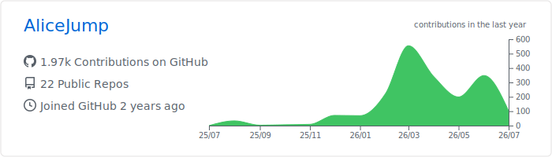
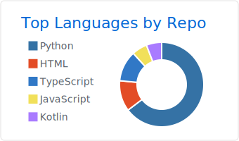
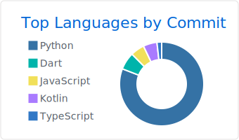

<!--
================================================================================
  AliceJump GitHub Profile README
  Dynamic services:
  - github-readme-stats-alpha-nine-65.vercel.app = 自部署 Vercel 实例 (已配置)
  - alicejump-profile-api.2630923991.workers.dev  = Cloudflare Workers (Typing SVG / ghpvc / Badge)
  - skill-icons.2630923991.workers.dev            = Cloudflare Workers (Skill Icons)
  - github-readme-activity-graph-beta-seven.vercel.app  = Vercel (Activity Graph)
  - ./profile/*.svg                             = GitHub Actions 生成静态文件
================================================================================
-->

  

<h1 align="center">AliceJump</h1>

  

  he/him

> [!NOTE]
> 这里用于展示个人项目、开源实践和一些持续变化的动态数据。

  
  
  
  

  

  

  
  

  

---

# 🏆 Achievements

  
  
  
  

---

# 🧰 Tech Stack

  
  
  
  
  
  
  
  
  

---

# 📈 Development Metrics

  
  

---

# 🚀 Featured Projects

## ok-end-field

> 终末地自动化工具

---

## ok-gf2

> 少女前线2自动化工具  

---

# 🧩 Technical Direction

- Python 自动化脚本
- OCR 与图像识别
- 游戏工具链
- 工作流自动化
- Python 工具链开发

---

# 📅 Current Focus

- OCR 识别率优化
- 自动化稳定性
- Feature Label 数据维护
- 工作流数据化
- 自动送货系统维护
- 自动化框架扩展性

---

# 💭 Philosophy

  <em>Solve problems, not showcase technology.</em>

---

> **部署说明**: 所有动态服务已迁移到 Cloudflare Workers + Vercel，无需自备服务器。
> 完整部署文档参见 [`deploy/`](./deploy/) · [`workers/`](./workers/) 目录。
